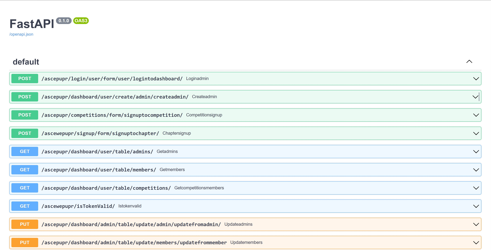
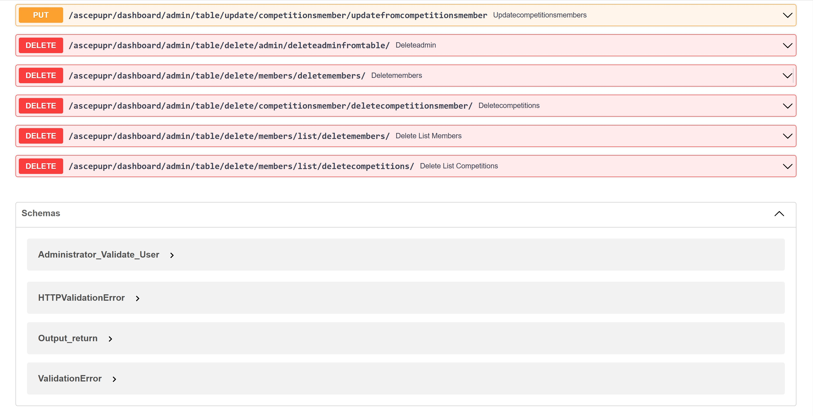

# Backend of ASCE Web App

## Table of Contents
- [About the Project](#about-the-project)
	* [Introduction](#introduction)
- [Getting Started](#getting-started)
	* [Prerequisites](#prerequisites)
	* [Installation](#installation)
- [Usage](#usage)

## About the Project
### Introduction
This demonstrates the implementation of the Back - End portion of the ASCE WEB Capstone Project with FASTAPI and the Python 3 programming language. It is able to work in conjunction with the Front - End of the aformentioned project and a MySQL Database composed of three (3) relational tables; these being: _Admins Table_, _Competitions Table_ and _Members Table_, with the purpose of handling various responsibilities, such as:
* Data input validation from the front end,
* The addition, deletion and updation of entries from the three (3) tables,
* Administrators' Account Authentication, and
* Data hashing.

## Getting Started
### Prerequisites
In order to use, test and modify the Back - End, the following pieces of software requirements must be met:

1.**Git:** As stated in the homepage of its website (https://git-scm.com/), 

> _Git_ is a free and open source distributed version control system designed to handle everything from small to very large projects with speed and efficiency.

For the purposes of this project, it will be used to communicate with the **GitHub** website so as to download this repository; as well as make updates to it. The link of _Git_'s Download Page is [here](https://git-scm.com/downloads).

2.**Python 3:** This is one of the various high - level programming languages that are currently in use today. The version that the Back - End uses is **Python 3.10.5**, and it can be downloaded from [here](https://www.python.org/downloads/release/python-3105/). With that being said, if another version of Python 3 is desired, go to [Python.org](https://www.python.org/).

3.**List of Python 3's Dependency Libraries:** This software depends of various pieces of code, known as libraries, created by the Python Community. The list of dependencies is shown below:
* anyio: 3.6.2
* cffi: 1.15.1
* click: 8.1.3
* colorama: 0.4.6
* cryptography: 40.0.2
* DateTime: 5.1
* dnspython: 2.3.0
* email-validator: 2.0.0.post2
* fastapi: 0.95.1
* greenlet: 2.0.2
* gunicorn: 20.0.4
* h11: 0.14.0
* idna: 3.4
* MarkupSafe: 2.1.2
* mysql: 0.0.3
* mysqlclient: 2.1.1
* pycparser: 2.21
* pydantic: 1.10.7
* PyMySQL: 1.0.2
* pytz: 2023.3
* sniffio: 1.3.0
* SQLAlchemy: 1.4.46
* starlette: 0.26.1
* typing_extensions: 4.5.0
* uvicorn: 0.20.0
* Werkzeug: 2.3.1
* zope.interface: 6.0
* PyJWT: 2.6.0
* zope.interface: 6.0
* python-dateutil: 2.8.2

**NOTE:** Do not worry about installing all of these libraries individually, an easier alternative will be shown in the next subsection.

4.**Visual Studio Code:** Also know as _VS Code_, this is a text editor created by the **Microsoft Corporation** that can be used to compile, debug and run computer programs with their own programming languages, like Python, C and C++. This is the [link](https://code.visualstudio.com/) of the Download Page of the program.

### Installation
Given that it all depends on the Operating System (OS) being used, after installing **Git**, **Python 3** and **Visual Studio Code** by following their respective installation steps, the software found in this repository can be now installed. As such, the steps are as follows:

1.Go to the location where the repository is wanted to be downloaded, an example of this location can be in the **Downloads** folder found in the Windows, Mac and Linux Operating Systems. For this guide, a Windows OS is being used, so: **C:\Users\{userId}\Downloads**, is the location path. It should be noted that _{userId}_ is the name of the user of the Windows account.

2.In such a location open **Command Prompt (CMD)** or the **Terminal** if using Linux or Mac, and type:
```
git clone {git_url}
```
It should be noted that the **{git_url}** of the repository can be found by clicking on the green button with the **< > Code** found in the webpage of the repository of GitHub.com. An example of a real _Git URL_ with the previous command is:
```
git clone https://github.com/GitHub-Account/asceweb_app_backend.git
```
After the GitHub Repository has been finally downloaded, a new folder, namely: **asceweb_app_backend**, should appear.

3.Start the **Visual Studio Code** text editor program and click on **File -> Open Folder**, and a new box that will ask for a folder name should appear. The location of the newly downloaded folder should be set, like: **C:\Users\{userId}\Downloads\asceweb_app_backend**. After the folder has been opened in _Visual Studio Code_, the following list of contents should appear on the left side of the screen:
```
ASCEWEB_APP_BACKEND
	> _pycache_
	> Backend
	> img
	.gitignore
	main.py
	README.md
	requirements.txt
```
4.In **Visual Studio Code** go to **Terminal -> New Terminal**, and, well, a new terminal should appear in the program. In it, one should be able to write; henceforth, the following line should be written followed by an **ENTER**:
```
python -m venv venv
```
if using Linux or Mac, write:
```
python3 -m venv venv
```
After this command completes its execution, a new folder should appear, as shown below:
```
ASCEWEB_APP_BACKEND
	> _pycache_
	> Backend
	> img
	> venv
	.gitignore
	main.py
	README.md
	requirements.txt
```
5.In the terminal run this next command:
```
venv/Scripts/activate 
```
If using Linux or Mac, the following command should be run instead:
```
source venv/bin/activate 
```
After this, the terminal should display a new text, i.e.: **(venv)**. This means that a new Python Virtual Enviroment has been created and activated for the development of this application!

6.Now, to install all of the Python 3's library dependencies for this software application, the next command should be used:
```
pip install -r requirements.txt
```
If using Linux or Mac, run this command instead:
```
pip3 install -r requirements.txt
```
After all the requirements have been installed, the program should be good to go!

## Usage
In order to run this program for development purposes, the following command should be run:
```
uvicorn main:app --reload
```
A new webpage should open in the web browser with the URL link of **http://127.0.0.1:8000**. Now, in the web browser, where such an URL link is, it should be changed for: **http://127.0.0.1:8000/docs**. Now, the following images should be seen:

<div align="center">

</div>
<div align="center">

</div>

Finally! You now have access locally to the Back - End!
